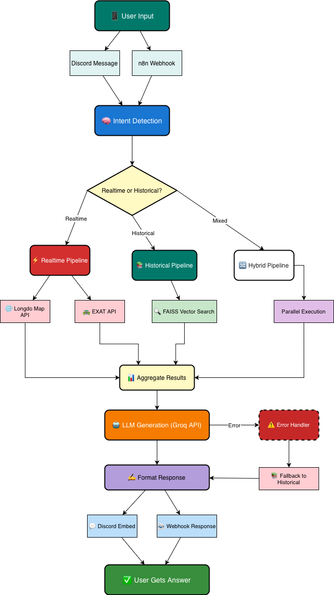

# 🚧 RoadBot AI – Road Accident Information Chatbot

## 📌 Overview

RoadBot AI คือแชตบอตสำหรับตอบคำถามเกี่ยวกับ **ข้อมูลอุบัติเหตุย้อนหลังบนท้องถนนในประเทศไทย**
ช่วยให้ผู้ใช้ค้นหาข้อมูลได้ง่ายขึ้นผ่านภาษาธรรมชาติ โดยไม่ต้องเปิดดู dataset หรือรายงานด้วยตนเอง

ระบบทำงานในลักษณะ:
**รับคำถาม → ตรวจสอบคีย์เวิร์ด Realtime → ค้นข้อมูลจาก Dataset/FAISS + Realtime API (Longdo Map/EXAT/Web Search) → สรุปคำตอบ → ส่งกลับผู้ใช้**

---

## 🎯 Problem

- ข้อมูลอุบัติเหตุส่วนใหญ่อยู่ในรูปแบบ dataset และรายงาน จึงเข้าถึงยากสำหรับผู้ใช้ทั่วไป
- ผู้ใช้ต้องใช้เวลาค้นหาข้อมูลจากหลายแหล่งและตีความข้อมูลเอง
- ยังไม่มีระบบที่ช่วยตอบคำถามเกี่ยวกับ **สถิติอุบัติเหตุย้อนหลัง** ได้สะดวกผ่านแชต

---

## 💡 Solution

- พัฒนา AI Chatbot สำหรับตอบคำถามอัตโนมัติเกี่ยวกับอุบัติเหตุทางถนน
- เชื่อมข้อมูลจาก `Google Sheet / local dataset` และระบบค้นคืนข้อมูลแบบ `RAG`
- รองรับการใช้งานผ่าน `Discord Bot`, `Webhook`, และสามารถเชื่อมต่อกับ `n8n` ได้

> หมายเหตุ: เวอร์ชันปัจจุบันเน้น **ข้อมูลย้อนหลัง** และมีการใช้ข้อมูลจราจรแบบ real-time มาร่วมด้วย

---

## ⚙️ Tech Stack

- `Node.js + Express` — Backend API
- `Python + FastAPI` — RAG Service
- `FAISS` — Vector Search
- `Sentence Transformers` — Embedding Model
- `Discord Bot` — Chat Interface
- `n8n` — Workflow Automation / Integration
- `Google Sheet / local dataset` — Data Source
- `Longdo Map API + EXAT API + OpenAI Web Search` — Realtime Data Source

---

## 🧩 System Architecture



---

## 🔄 Workflow Concept

1. **Trigger**
   - Discord message
   - Webhook request จาก n8n หรือ Web Chat

2. **Process**
   - รับคำถามจากผู้ใช้
   - Backend API วิเคราะห์ intent ของคำถาม
   - RAG Service ค้นข้อมูลจาก `FAISS index` และ dataset อุบัติเหตุ
   - สรุปและจัดรูปแบบคำตอบเป็นภาษาไทย

3. **Output**
   - ส่งคำตอบกลับไปยังผู้ใช้ผ่าน Discord / Webhook / API

4. **Error Handling**
   - ตรวจสอบสถานะ backend และ RAG service
   - ส่งข้อความ fallback เมื่อระบบยังไม่พร้อมหรือค้นข้อมูลไม่พบ

---

## 📂 Project Structure

```text
roadbot-ai/
├── workflow.json
├── roadbotai-backend/
│   ├── docker-compose.yml
│   ├── package.json
│   ├── data/
│   │   ├── faiss.index
│   │   └── faiss_meta.json
│   ├── rag_service/
│   │   ├── app.py
│   │   └── requirements.txt
│   ├── scripts/
│   │   ├── ingestSheet.js
│   │   └── runRag.mjs
│   └── src/
│       ├── server.js
│       ├── config/
│       ├── routes/
│       ├── services/
│       └── lib/
└── roadbotai-discord-n8n/
    ├── bot.py
    ├── package.json
    ├── requirements-bot.txt
    └── scripts/
        └── runBot.mjs
```

---

## 🚀 Getting Started

### 1. Clone repo

```bash
git clone https://github.com/CryptozDev/roadbot-ai.git
cd roadbot-ai
```

### 2. Install dependencies

#### Backend
```bash
cd roadbotai-backend
npm install
```

#### Python RAG Service
```bash
python3 -m pip install -r rag_service/requirements.txt
```

#### Discord Bot
```bash
cd ../roadbotai-discord-n8n
python3 -m pip install -r requirements-bot.txt
npm install
```

### 3. Setup environment variables

กำหนดค่าไฟล์:
- `roadbotai-backend/.env`
- `roadbotai-discord-n8n/.env.bot`
- `roadbotai-backend/.env.example`
- `roadbotai-discord-n8n/.env.bot.example`
- `roadbotai-discord-n8n/.env.n8n.example`

ตัวอย่างค่าที่ใช้งาน:

```env
# RoadBotAI backend environment example
# Copy this file to roadbotai-backend/.env and fill the values.

PORT=4000
NODE_ENV=development
FRONTEND_ORIGIN=*
BOT_API_TOKEN=roadbot_n8n_discord_2026_XXXX
PY_RAG_URL=http://127.0.0.1:8001
QWEN_MODEL_NAME=Qwen/Qwen2.5-1.5B-Instruct
EMBEDDING_MODEL_NAME=sentence-transformers/paraphrase-multilingual-MiniLM-L12-v2
FAISS_INDEX_PATH=./data/faiss.index
FAISS_META_PATH=./data/faiss_meta.json
TOP_K=6
DEFAULT_SHEET_URL=https://docs.google.com/spreadsheets/d/YOUR_SHEET_ID/edit
DEFAULT_SHEET_GID=0
RAG_CHAT_TIMEOUT_MS=45000
RAG_INGEST_TIMEOUT_MS=300000
RAG_TIMEOUT_MS=180000
OPENAI_API_KEY=your_openai_api_key
OPENAI_MODEL_NAME=gpt-4o-mini
LONGDO_EVENT_URL=https://event.longdo.com/feed/json
EXAT_API_BASE_URL=https://exat-man.web.app/api
OPENAI_WEB_SEARCH_ENABLED=true
OPENAI_WEB_MODEL=gpt-4.1-mini
REALTIME_ROUTE_RADIUS_KM=12
```

```env
# Discord bot environment example
# Copy this file to .env.bot and fill the values.

DISCORD_BOT_TOKEN=your_discord_bot_token
N8N_WEBHOOK_URL=http://localhost:5678/webhook/roadbotai-n8n-discord
BOT_COMMAND_PREFIXES=!roadbot,!rb
```

```env
# n8n environment example for RoadBot AI workflow
# Use these variables in your n8n instance or .env file.

ROADBOT_BACKEND_URL=http://localhost:4000/api/chat/bot
ROADBOT_BOT_TOKEN=roadbot_n8n_discord_2026_XXXX
DISCORD_WEBHOOK_URL=https://discord.com/api/webhooks/xxx/yyy
```

> ใช้ไฟล์ตัวอย่างเพื่อคัดลอกและสร้างไฟล์ `.env` จริงก่อนรันระบบ


### 4. Run project

#### Start backend
```bash
cd roadbotai-backend
npm run dev
```

#### Start Discord bot
```bash
cd ../roadbotai-discord-n8n
python bot.py
```

---

## 🧪 API Testing

สามารถทดสอบได้ผ่าน:

- Discord Bot
- Backend API
- n8n Webhook

ตัวอย่าง health check:

```bash
curl http://127.0.0.1:4000/health
```

---

## 📊 Dataset

ระบบใช้ข้อมูลอุบัติเหตุย้อนหลังจาก dataset ที่นำเข้าเข้าสู่ `FAISS index` เพื่อใช้ค้นคืนข้อมูล

ข้อมูลหลักที่ใช้งาน เช่น:
- จังหวัด
- สายทาง / รหัสสายทาง
- กิโลเมตรที่เกิดเหตุ
- ลักษณะการเกิดเหตุ
- สาเหตุ
- สภาพอากาศ
- จำนวนผู้เสียชีวิต / ผู้บาดเจ็บ
- พิกัด `LATITUDE / LONGITUDE`

---

## ⚡ Realtime Features

ระบบรองรับการค้นหาข้อมูลแบบ **Realtime** จากแหล่งข้อมูลภายนอกเพิ่มเติม:

### การทำงาน
- เมื่อคำถามมีคำสำคัญเช่น "ตอนนี้", "ล่าสุด", "เรียลไทม์", "สด", "คืนนี้", "วันนี้", "พรุ่งนี้"
- ระบบจะค้นหาข้อมูลจาก:
  - **Longdo Map Events** - เหตุการณ์จราจรและอุบัติเหตุจาก Longdo Map
  - **EXAT API** - ข้อมูลจากกรมทางหลวง
  - **OpenAI Web Search** - ค้นหาข้อมูลจากเว็บสาธารณะ (ถ้าเปิดใช้งาน)

### การตั้งค่า
```env
OPENAI_WEB_SEARCH_ENABLED=true
REALTIME_ROUTE_RADIUS_KM=12
OPENAI_WEB_MODEL=gpt-4.1-mini
LONGDO_EVENT_URL=https://event.longdo.com/feed/json
EXAT_API_BASE_URL=https://exat-man.web.app/api
```

### ตัวอย่างการใช้งาน
- "ตอนนี้มีอุบัติเหตุที่ไหนบ้าง"
- "เส้นทางกรุงเทพไปเชียงใหม่วันนี้มีอะไรใหม่"
- "เรียลไทม์ สภาพถนนสายเอเชียตอนนี้"

> **โหมดการทำงาน**: ระบบจะแสดง "📡 Realtime + Dataset" เมื่อใช้ฟีเจอร์ realtime ร่วมกับข้อมูลย้อนหลัง

---

## 📌 Future Improvements

- เพิ่มการเชื่อมต่อข้อมูลจราจรหรืออุบัติเหตุแบบ real-time
- รองรับ LINE OA / Web Chat เพิ่มเติม
- เพิ่ม dashboard สำหรับสถิติและ visualization
- ปรับปรุง route analysis ให้ละเอียดขึ้นในระดับถนนหรืออำเภอ

---

## 👨‍💻 Author

### RoadBot AI (กลุ่ม Alpha Stack)
- 66053541 จารุกิตติ์ โลบไธสง
- 66073498 ฆนาการ ศรีเพ็ญ
- 66044213 รัตนพล ศรีโนนยาง
- 66080795 นรวัฒน์ ดูการดี
- 66073998 ชำนาญ เกษมสัตย์
